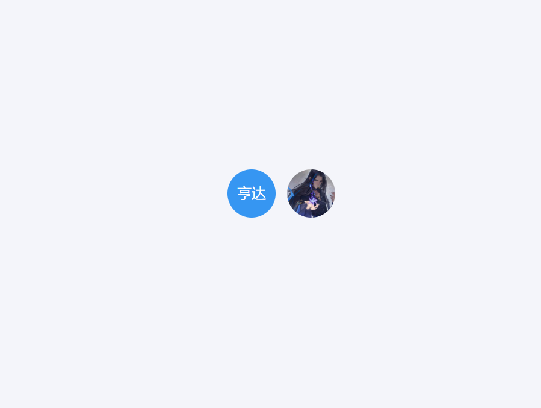

**开发背景：**

实现类似钉钉单人头像

### 1.查看示例

### 2.在项目中使用

### 3.可选配置说明

| 属性            | 说明                       | 类型   | 默认值                 |
|-----------------|----------------------------|--------|------------------------|
| scale           | 缩放比例（选填）           | String | 1                      |
| num             | 显示+num数字               | String | -                      |
| name            | 中文名                     | String | -                      |
| mode            | 选择显示圆形还是方形的头像 | String | 填入square显示方形头像 |
| fontColor       | 字体颜色                   | String | #fff                   |
| backgroundColor | 背景颜色                   | String | #3696F2                |
| faceUrl         | 图片地址                   | String | -                      |

### 4.关于二次开发
可根据自己项目的实际情况进行如下开发

### 更新日志
v1.0.0
- 初版
  
